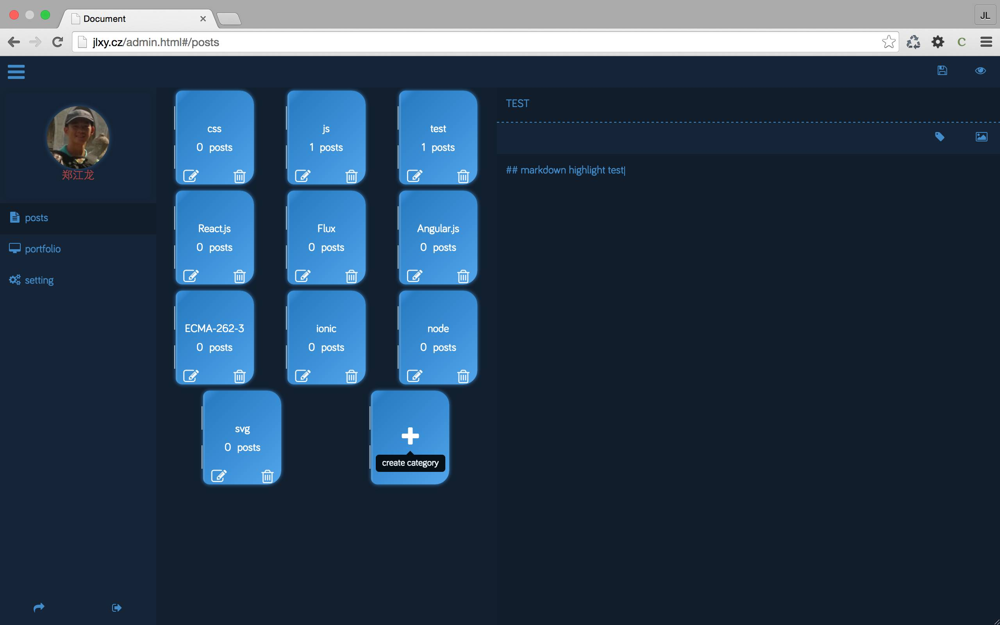
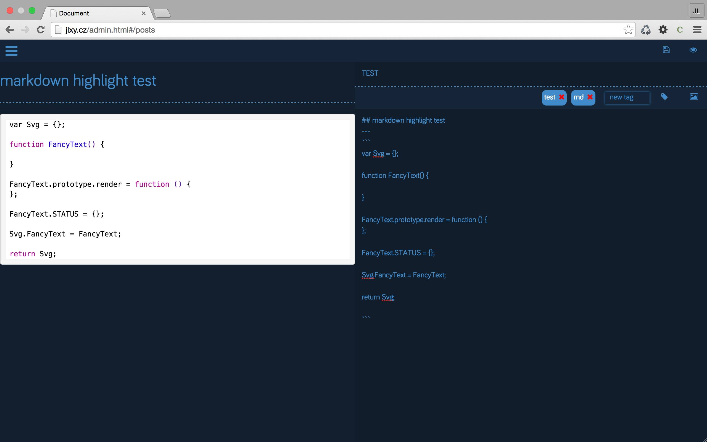
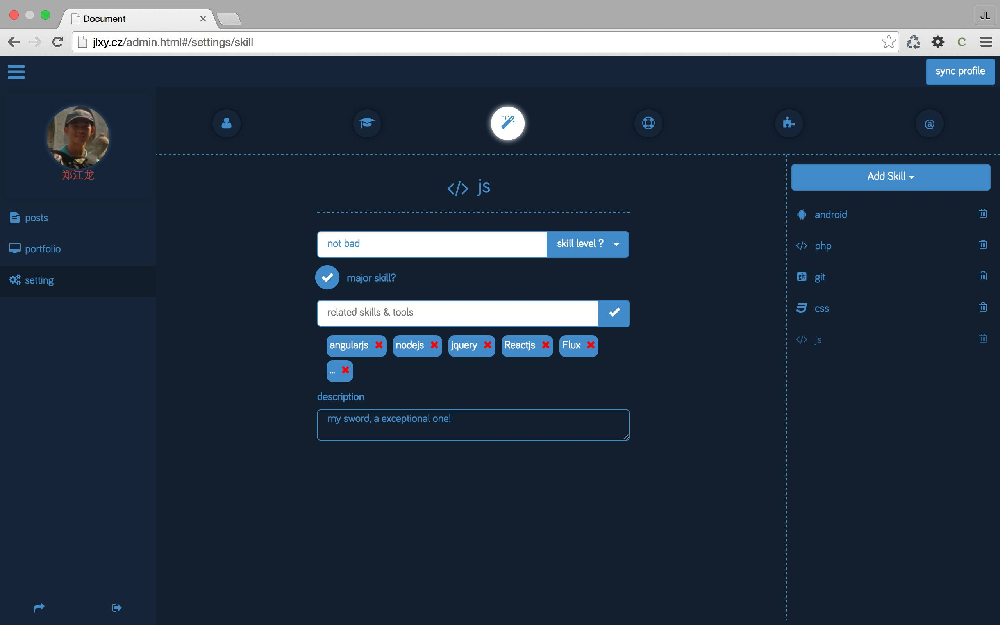

# izone

> simple personal blog & portfolio & resume website
>  [example](http:jlxy.cz) 

===
### screen shots


---


---


===

### Tech stack
- angularjs
- nodejs
- sass
- bootstrap
- mongodb
- jwt
- qiniu

===

### Features
- post
    + CURD
    + categories
    + tags
    + insert[upload] pic
    + markdown & real-time preview
    + highlight
    + disqus
- portfolio
    + portfolio item CURD
    + image | link | title | description
    + showoff page
    + qiniu
- profile setting
    + basis info [avatar,name,birth,city,characters,description]
    + edu list
    + skills
    + contact info
    + work experience
- about/resume
    + based on profile setting
- ***All Pages Are of Responsive Design***


### TODO
- SEO

===

## install:
```
git clone https://github.com/jl-/izone.git
cd izone
cd client
bower install
cd ..
npm install
```

## start serve
```
grunt app
```

===


### config:
- server/configs/config.js
- client/scripts/configs/AppConfig.js
- client/scripts/resume/config.js
- client/partials/content/blog/detail.tpl.html

### for deployment 
`grunt build`

===

> follow the instruction in the comment area of the config files listed above
